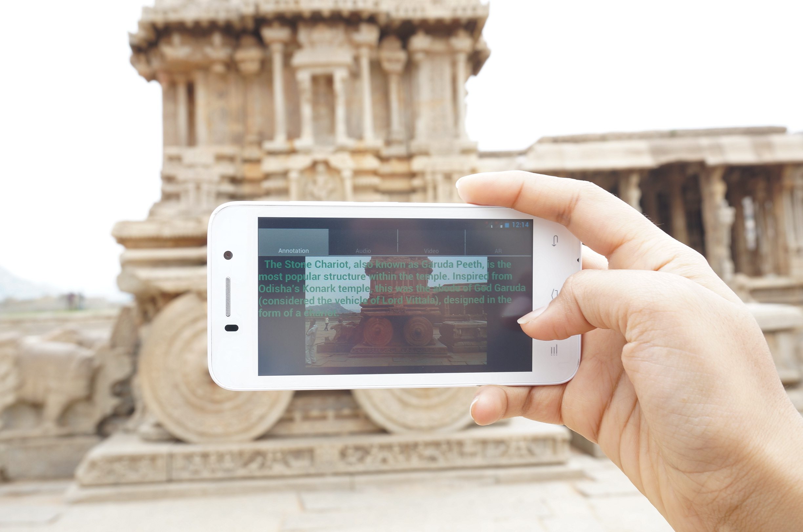

## About Me

I work in AI and deep learning, particularly in the domain of computer vision. Currently heading the computer vision group at [Abzooba, Inc.](https://xpresso.ai) where I build and deploy enterprise solutions in AI. 

Previously, I co-founded [Wazzat Labs](https://wazzatlabs.com), a visual recognition startup, particularly focused on solving problems in fashion retail. I worked with [Dr. C. V. Jawahar](https://faculty.iiit.ac.in/~jawahar/) during my MS by Research at [IIIT Hyderabad](https://www.iiit.ac.in/) and also during the journey at Wazzat Labs.

### Work Experience - Project Highlights
- **Visual Intelligence at xpresso.ai**
  - Led research and development of visual intelligence engine for multi-platform conversational bots.
  - Demo Videos (click to play in Youtube), Jan to Aug 2017
    - Visual intelligence on FB messenger chatbot.
    

- **Visual recognition at Wazzat Labs**
  - Led research and development of visual recognition solutions primarily aimed at product discovery and search for fashion e-tail.
  - Mobile visual search and social fashion lookup solutions.
  - Demo videos (click to play in Youtube), Dec 2014 to Nov 2016
    - Looks by Wazzat: Fashion visual recognition platform to showcase and discover shoppable fashion trends. 
     
     
     
    - AR for automobile repair guide (click to play in Youtube), Jan to Mar 2014
    
- **MASTER's Thesis**
  - [Instance Retrieval and Image Auto-Annotations on Mobile Devices](docs/JayThesis.pdf)
    
    - Mobile instance retrieval requires a significant reduction in the visual search index and relevant optimization in efficient real-time image processing for feature extraction and search. To achieve this, we describe a set of strategies that can reduce the visual index up to 150 × compared to a standard implementation of the instance retrieval solution, popularly implemented on desktops or servers. While these reduction steps affect the overall mean Average Precision (mAP), they are able to maintain a good Precision for the top K results (P_K). We argue that for such offline application, maintaining a good P_K is sufficient. The effectiveness of this approach is demonstrated on several standard databases.
    

### Publications

1. **[Optimizing Storage Intensive Vision Applications to Device Capacity.](https://cvit.iiit.ac.in/images/ConferencePapers/2014/Rohit2014Optimizing.pdf)**
R Girdhar,  J Panda and C. V. Jawahar *In ACCV, 2014 at Singapore*
  - In this paper, we propose a framework to configure memory requirements of vision applications. We start from a gold standard desktop application, and reduce the the size for a given the memory constraint. We formulate the storage optimization problem as mixed integer programming (mip) based optimization to select the most relevant subset of data to be retained. For large data sets, we use a greedy approximate solution which is empirically comparable to the optimal mip solution. We demonstrate the method in two different use cases: (a) Instance retrieval task where an image of a query object is looked up for instant recognition/annotation, and (b) Augmented reality where computational requirement is minimized by rendering and storing precomputed views. In both the cases, we show that our method allows a reduction in storage by almost 5× with no significant performance loss.
  
2. **[Offline Instance Retrieval with Small Memory Footprint](http://researchweb.iiit.ac.in/~jayaguru.panda/PandaICCV13/Panda_ICCV13.pdf)**
J Panda, Michael S Brown and C. V. Jawahar *In ICCV, 2013 at Sydney, Australia* 
[Project Page](http://researchweb.iiit.ac.in/~jayaguru.panda/PandaICCV13/) | 
  - Mobile instance retrieval requires a significant reduction in the visual index size. To achieve this, we describe a set of strategies that can reduce the visual index up to 150 × compared to a standard implementation of the instance retrieval solution, popularly implemented on desktops or servers. While these reduction steps affect the overall mean Average Precision (mAP), they are able to maintain a good Precision for the top K results (P_K ). We argue that for such offline application, maintaining a good P_K is sufficient. The effectiveness of this approach is demonstrated on several standard databases.
  - Demo Video (click to play in Youtube)
  
  
3. **[Rich and Efficient Annotations for Large Photo Collections](http://web.iiit.ac.in/~jayaguru.pandaug08/Jay_ACPR_crc.pdf)**
J Panda and C.V. Jawahar *In ACPR, 2013 at Naha, Japan*  
  - Large unstructured Photo collections from tourist and heritage sites can be described with detailed and part-wise annotations resulting in an improved automatic search and enhanced photo browsing experience. We demonstrate an interactive web-based community annotation tool that allows multiple users to add, view, edit and suggest rich annotations for images in internet photo collections.
  
4. **[Heritage App: Annotating Images on Mobile Phones.](https://researchweb.iiit.ac.in/~jayaguru.panda/HeritageApp/Panda_HeritageApp_ICVGIP12.pdf)**
J Panda, S Sharma and C. V. Jawahar *In ICVGIP, 2012 at Mumbai, India* 
[Project Page](http://researchweb.iiit.ac.in/~jayaguru.panda/HeritageApp/) | 
  - In this paper, we demonstrate a computer vision application for instant auto-annotations on mobile phones. A tourist or a student, visits a heritage monument or site and is interested in specific artistic details of the structures. He/she queries the app with concerned images and the relevant information is returned as text (or even audio). There is no communication overhead or cost associated with such a search.
  - Demo Video (click to play in Youtube)
  
  

### Other projects
1. Image Inpainting Techniques
[Report](https://web.iiit.ac.in/~jayaguru.pandaug08/ImageInpaintingPPT.pdf)
  - Developed an application that works with a variety of images(medical, industrial, natural) and fills up “holes” in the images in a natural way. This work was adjudged winner at GE Intern Challenge 2011 during the summer internship. 

2. Image Fusion for Context Enhancement and Video Surrealism
[Report](https://web.iiit.ac.in/~jayaguru.pandaug08/imageFusionPPT.pdf) | [Codes](https://web.iiit.ac.in/~jayaguru.pandaug08/Project.CODE.tar.gz)
  - This project was aimed at enhancing low-contrast images/videos(eg. Night-time pics/traffic videos) using the high-contrast(say, day-time) image of the same scene. It uses the Gradient Domain approach to capture information from the low-contrast image/video and blend it with the context obtained from the high-contrast image to get an context-enhanced image/video. 
